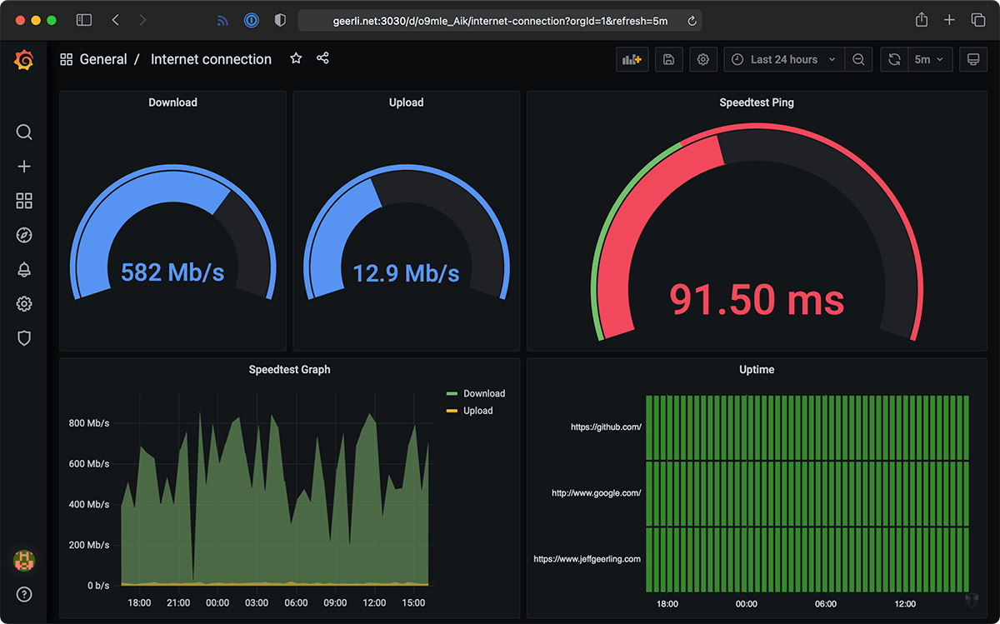

## Monitorando Internet
------------------------
> Este repositório é um fork do repositório [geerlingguy/internet-pi](https://github.com/geerlingguy/internet-pi) porém adaptado para as minhas necessidades e testes, o repositório original tem mais itens e configurações para monitorar outros ativos.

## Estrutura
------------
O diretório principal  `veloci-check` tem os arquivos necessários para instalação/configuração do projeto.

Repositório
 - [internet-monitoring](https://github.com/andretecco/internet-monitoring)

## Informações Adicionais
-------------------------

Portas mapeadas com o host
>- Prometheus
>  - `9090:9090 (Docker:Host)`
>- Grafana
>  - `3030:3000 (Docker:Host)`
>- Ping (blackbox-exporter)
>	 - `9115:9115 (Docker:Host)`
>- Speedtest
>	 - `9798:9798 (Docker:Host)`
>- Nodeexp (Node Exporter)
>  - `9100:9100 (Docker:Host)`

Acessando os serviços
>- Prometheus
>  - `IP-HOST:9090`
>- Grafana
>  - `IP-HOST:3000`
>- Ping (blackbox-exporter)
>  - `IP-HOST:9115`
>- Speedtest
>  - `IP-HOST:9798`
>- Nodeexp (Node Exporter)
>  - `IP-HOST:9100`

Exemplo
> Acessando o Grafana, IP-HOST 10.0.0.1
>   - http://10.0.0.1:3000

Senhas de acesso.
> Senha padrão admin, no primeiro acesso é solicitada a troca de senha.

## Configuração 
-----------------

1. [Instalando o Ansible](https://docs.ansible.com/ansible/latest/installation_guide/intro_installation.html). A maneira mais simples é utilizando o Pip.
   1. Debian: `sudo apt-get install -y python3-pip`  
   2. Instalando: `python3 -m pip install --user ansible`  
2. Clonar o repositório: `git clone https://github.com/andretecco/veloci-check.git, acessar o diretório do projeto:` cd veloci-check.  
3. Instalar pacotes no arquivo requirements: `ansible-galaxy collection install -r requirements.yml`
4. Ajustar o arquivo de inventário:
   - `hosts` (colocar o IP do host que será instalado/configurado a Stack ou `connection=local` caso utilize sua própria "máquina" para instalar/configurar a Stack).
5. Execute o playbook: `ansible-playbook -i hosts conf_link_monitoring.yml -kKb -vv`  
   - `K`:  (--ask-pass pedir senha de conexão).
   - `b`:  (--become escalar privilégios (sudo) para executar as instruções).
   - `k`:  (--ask-pass  pedir senha ao escalar privilégios, exemplo uso do sudo).
   - `vv`: Modo verbose, para imprimir mais mensagens referente a execução.

> **Observações**: 
>   - Incluir o usuário que irá executar o playbook no arquivo hosts (ansible_user), pois esse usuário será adicionado ao grupo docker e dessa forma ter permissões para executar o deploy da stack.
> 	  -  Exemplo: `10.0.0.1 ansible_user=user`

## Dashboard Grafana
------------------------
